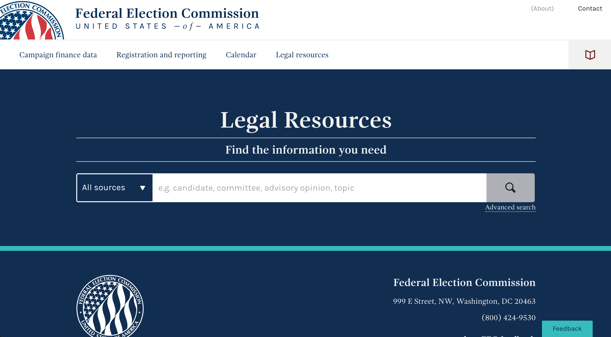

# Legal Resources home

_this feature is currently being designed_ _for more on this, see [Legal Resources Research Presentation Highlights](../directional_research/legal_research_highlights_presentation.pdf), [Legal Resources Research Presentation Highlights](../directional_research/legal_resources_workshop_notes.pdf) and [Legal Resources Analytics Readout](../directional_research/legal_resources_analytics_read_out.pdf)_

## Search

feature | issues | last tested | gif/pic | test notes
:------ | :----- | :---------- | :------ | :---------
|

## Directional Research

- People have a hard time finding the things they need, and little confidence the things they find are enough.
- So, finding things. This is a very common challenge, especially for sites that have built up over time and which house extensive content.
- If we break down finding things a bit more, we see three main parts:

  - Searching for things

    - Using the existing search features doesn't reliably produce useful or trustworthy results.
    - There are multiple siloed search fields looking into different databases.
    - Sometimes searching produces too few or too many results.
    - When there are too many, it's difficult to refine the results to the meaningful ones.
    - When search on FEC.gov doesn't produce the desired results, it either leaves users uncertain or sends them to external resources.

  - Viewing things

    - The actual display of individual resources is sometimes clunky or difficult to read.
    - Users are constantly assessing whether the resource in front of them is the right thing for them, so making the viewing of the thing easy is important.
    - Resources are frequently housed in frames, complicating sharing or printing
    - Sometimes they can't be directly linked to, which is important for sharing or saving.
    - When direct direct links exist, some are actually just search query presets that sometimes aren't always effective.

  - Moving between things

    - Relationships often exist between resources.

      - Complaints reference other MURs, AOs reference Regs. AOs often address similar issues.

    - Moving between things is important because users, once they determine that a given resource is not right, or that it's close and they want to dig deeper, they need to be able to move towards the answer easily.

    - Resources that relate to each other are frequently not hyperlinked, preventing easy cross-referencing and movement between.
    - Existing links can lead to dead ends instead of meaningful results.
    - Resources that deal with similar topics are not categorized as such.

- Some users overcome these issues

  - Particularly those whose work is heavily dependent on using the resources on a regular basis. They develop workarounds and habits that allow them to navigate the difficulties despite their challenges
  - Others with access to professional legal support often rely on it.
  - Others look to Lexis or Westlaw, which they find easier to use.
  - These considerations favor more established users over infrequent or new users.

_this feature is currently being designed_ _for more on this, see [Legal Resources Research Presentation Highlights](../directional_research/legal_research_highlights_presentation.pdf), [Legal Resources Research Presentation Highlights](../directional_research/legal_resources_workshop_notes.pdf) and [Legal Resources Analytics Readout](../directional_research/legal_resources_analytics_read_out.pdf)_
